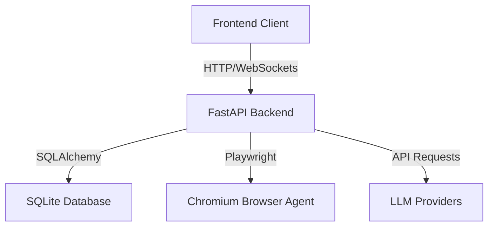

# Architecture Documentation

## System Topology

## Core Orchestration
The system coordinates autonomous induction sessions via:
1. **RuntimeOrchestrator**: Manages supervisor communication.
2. **Supervisors**: Decoupled handlers for presentation, browser, and conversation domains.
3. **Meeting Adapters**: Abstract interface to automate platforms like Microsoft Teams.
